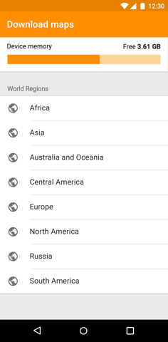

# Download Maps by using OsmAnd API

The app allow download maps by using OsmAnd API.

## Features
* Download maps to one thread (queue) by using DownloadManager.
* Parsing XML file to fetch data such as name countries, continents, regions.
* Created DB to save the state of the maps (downloaded, available for download).

